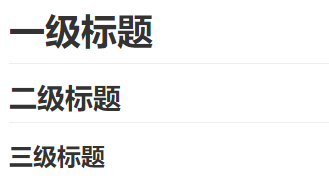
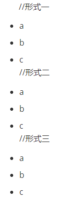
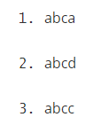
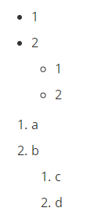

# MD语法规则  #

<p align="right"><font color=gray>作者：XiaoPb</font></p>

## 一. 标题 ##

```c
前面带#号，后面带文字，分别表示h1-h6,只到h6，而且h1下面会有一条横线
# 一级标题 #
## 二级标题 ##
### 三级标题 ###
```
<table>
	<tr>
        <td align="center"><a href="https://github.com/XiaoPb/blogs/tree/master/mdGrammarRules"><br /><sub><b>标题示例</b></sub></a>
	</tr>
</table>
## 二. 列表

### 无序列表 ###

```
//形式一
+ a
+ b
+ c
//形式二
- a
- b
- c
//形式三
* a
* b
* c
```

### 有序列表 ###

```
1. abc
2. abc
3. abc
```
<table>
	<tr>
        <td align="center"><a href="https://github.com/XiaoPb/blogs/tree/master/mdGrammarRules"><br /><sub><b>无序列表</b></sub></a>
        <td align="center"><a href="https://github.com/XiaoPb/blogs/tree/master/mdGrammarRules"><br /><sub><b>有序列表</b></sub></a>
	</tr>
</table>
### 列表嵌套 ###

```
+ 1
+ 2
  + 1
  + 2
  
1. a
2. b
  1. c
  2. d
```
<table>
	<tr>
        <td align="center"><a href="https://github.com/XiaoPb/blogs/tree/master/mdGrammarRules"><br /><sub><b>列表嵌套</b></sub></a>
	</tr>
</table>
## 三. 图片 ##

### md语法 ###

1. `  `

   例子：```  ```

   效果如下：

   

2. html方式

   ```html
   <table>
   	<tr>
          <td align="center">
          <!-- 图片居中 -->
          <a href="https://github.com/XiaoPb/blogs/tree/master/mdGrammarRules">
          <!-- 图片Git项目地址 -->
          
          <!-- 图片在项目的具体地址 --><!-- 图片宽度 -->
          <br /><sub><b>GitHub</b></sub>
          <!-- 图片标识 -->
          </a>
   	</tr>
   </table>
   ```

   <table>
   	<tr>
          <td align="center">
          <a href="https://github.com/XiaoPb/blogs/tree/master/mdGrammarRules">
          
          <br /><sub><b>GitHub</b></sub>
          </a>
   	</tr>
   </table>

3. 


|节次|星期一|星期二|星期三|星期四|星期五|星期六|星期日|
|:----:|:----:|:----:|:----:|:----:|:----:|:----:|:----:|
|center|center|left|right|left|right|left|right|
|center|center|left|right|left|right|left|right|
|center|center|left|right|left|right|left|right|


<div id="StuTable-body" class="x-panel-body x-panel-body-default x-layout-fit x-closable x-panel-body-closable x-panel-body-default-closable x-panel-body-default x-panel-body-default-closable" style="padding: 2px; overflow: auto; width: 714px; height: 903px; left: 0px; top: 0px;"><div class="x-panel x-fit-item x-panel-default" style="margin: 0px; width: 708px; height: 897px;" id="ext-comp-1058"><div id="ext-comp-1058-body" class="x-panel-body x-panel-body-default x-border-layout-ct x-panel-body-default" style="padding: 0px; width: 708px; height: 897px; left: 0px; top: 0px;"><div class="x-panel x-panel-default-framed x-border-item x-box-item" id="queryform-1043" style="margin: 0px; width: 706px; right: auto; left: 0px; top: 0px; height: 56px;"><div id="queryform-1043-body" class="x-panel-body x-panel-body-default-framed x-layout-fit x-panel-body-default-framed x-docked-noborder-top x-docked-noborder-right x-docked-noborder-bottom x-docked-noborder-left" style="width: 696px; left: 0px; top: 0px; height: 46px;"><fieldset class="x-fieldset x-fieldset-with-title x-fieldset-with-header x-fit-item x-fieldset-default" style="margin: 0px; width: 696px;" id="fieldset-1044"><legend class="x-fieldset-header x-fieldset-header-default" id="fieldset-1044-legend"><span id="fieldset-1044-legend-outerCt" style="display:table;"><div id="fieldset-1044-legend-innerCt" style="height: 100%; vertical-align: top; display: table-cell;" class=""><div class="x-component x-fieldset-header-text x-component-default" id="fieldset-1044-legendTitle">请输入查询条件，按查询键开始</div></div></span></legend><div id="fieldset-1044-body" class="x-fieldset-body x-column-layout-ct" style="width: 674px;"><span id="fieldset-1044-outerCt" style="display: table; width: 100%; table-layout: fixed;"><div id="fieldset-1044-innerCt" style="display:table-cell;height:100%;vertical-align:top;" class=""><table class="x-field x-table-plain x-form-item x-form-type-text x-column x-field-default x-column-form-item" style="margin: 0px 0px 6px; width: 165px; table-layout: fixed;" cellpadding="0" id="termcombo-1045"><tbody><tr role="presentation" id="termcombo-1045-inputRow" class="x-form-item-input-row"><td role="presentation" id="termcombo-1045-labelCell" style="" valign="top" halign="right" width="45" class="x-field-label-cell"><label id="termcombo-1045-labelEl" for="termcombo-1045-inputEl" class="x-form-item-label x-unselectable x-form-item-label-right" style="width:40px;margin-right:5px;" unselectable="on">学期:</label></td><td role="presentation" class="x-form-item-body  " id="termcombo-1045-bodyEl" colspan="2" style="width: 100%;"><table id="termcombo-1045-triggerWrap" class="x-form-trigger-wrap" cellpadding="0" cellspacing="0" style="width: 100%; table-layout: fixed;"><tbody><tr><td id="termcombo-1045-inputCell" class="x-form-trigger-input-cell" style="width: 100%;"><div class="x-hide-display x-form-data-hidden" role="presentation" id="ext-gen1170"></div><input id="termcombo-1045-inputEl" type="text" class="x-form-field x-form-required-field x-form-text x-trigger-noedit" autocomplete="off" value="2019-2020下学期" name="term" readonly="readonly" aria-invalid="false" style="width: 100%;"></td><td valign="top" class=" x-trigger-cell x-unselectable" style="width:17px;" id="ext-gen1169"><div class="x-trigger-index-0 x-form-trigger x-form-arrow-trigger x-form-trigger-first" role="button" id="ext-gen1168"></div></td></tr></tbody></table></td><td role="presentation" id="termcombo-1045-sideErrorCell" valign="middle" style="display: none;" width="17"><div role="presentation" id="termcombo-1045-errorEl" class="x-form-error-msg x-form-invalid-icon" style="display:none" data-errorqtip=""></div></td></tr></tbody></table><a class="x-btn x-unselectable x-column x-btn-default-small x-noicon x-btn-noicon x-btn-default-small-noicon" style="margin:0px 3px 0px 3px;" role="button" hidefocus="on" unselectable="on" tabindex="0" id="button-1046"><span id="button-1046-btnWrap" class="x-btn-wrap" unselectable="on"><span id="button-1046-btnEl" class="x-btn-button"><span id="button-1046-btnInnerEl" class="x-btn-inner x-btn-inner-center" unselectable="on">查询</span><span role="img" id="button-1046-btnIconEl" class="x-btn-icon-el  " unselectable="on" style=""></span></span></span></a></div></span></div></fieldset></div></div><div class="x-panel x-grid-with-col-lines x-grid-with-row-lines x-border-item x-box-item x-panel-default x-grid" style="width: 706px; height: 839px; margin: 0px; right: auto; left: 0px; top: 56px;" id="showgrid-1047"><div class="x-grid-header-ct x-docked x-grid-header-ct-default x-docked-top x-grid-header-ct-docked-top x-grid-header-ct-default-docked-top x-box-layout-ct" style="border-width: 1px; width: 706px; right: auto; left: 0px; top: 0px;" id="headercontainer-1048"><div id="headercontainer-1048-innerCt" class="x-box-inner " role="presentation" style="width: 747px; height: 22px;"><div id="headercontainer-1048-targetEl" class="x-box-target" style="width: 747px;"><div class="x-column-header x-column-header-align-left x-box-item x-column-header-default x-unselectable x-column-header-first" style="border-top-width: 1px; border-bottom-width: 1px; border-left-width: 1px; width: 30px; right: auto; left: 0px; top: 0px; margin: 0px;" id="gridcolumn-1049"><div id="gridcolumn-1049-titleEl" class="x-column-header-inner"><span id="gridcolumn-1049-textEl" class="x-column-header-text">节次</span><div id="gridcolumn-1049-triggerEl" class="x-column-header-trigger" style=""></div></div></div><div class="x-column-header x-column-header-align-left x-box-item x-column-header-default x-unselectable" style="border-top-width: 1px; border-bottom-width: 1px; border-left-width: 1px; right: auto; left: 30px; top: 0px; margin: 0px; width: 100px;" id="gridcolumn-1050"><div id="gridcolumn-1050-titleEl" class="x-column-header-inner"><span id="gridcolumn-1050-textEl" class="x-column-header-text">星期一</span><div id="gridcolumn-1050-triggerEl" class="x-column-header-trigger" style=""></div></div></div><div class="x-column-header x-column-header-align-left x-box-item x-column-header-default x-unselectable" style="border-top-width: 1px; border-bottom-width: 1px; border-left-width: 1px; right: auto; left: 130px; top: 0px; margin: 0px; width: 100px;" id="gridcolumn-1051"><div id="gridcolumn-1051-titleEl" class="x-column-header-inner"><span id="gridcolumn-1051-textEl" class="x-column-header-text">星期二</span><div id="gridcolumn-1051-triggerEl" class="x-column-header-trigger"></div></div></div><div class="x-column-header x-column-header-align-left x-box-item x-column-header-default x-unselectable" style="border-top-width: 1px; border-bottom-width: 1px; border-left-width: 1px; right: auto; left: 230px; top: 0px; margin: 0px; width: 100px;" id="gridcolumn-1052"><div id="gridcolumn-1052-titleEl" class="x-column-header-inner"><span id="gridcolumn-1052-textEl" class="x-column-header-text">星期三</span><div id="gridcolumn-1052-triggerEl" class="x-column-header-trigger"></div></div></div><div class="x-column-header x-column-header-align-left x-box-item x-column-header-default x-unselectable" style="border-top-width: 1px; border-bottom-width: 1px; border-left-width: 1px; right: auto; left: 330px; top: 0px; margin: 0px; width: 100px;" id="gridcolumn-1053"><div id="gridcolumn-1053-titleEl" class="x-column-header-inner"><span id="gridcolumn-1053-textEl" class="x-column-header-text">星期四</span><div id="gridcolumn-1053-triggerEl" class="x-column-header-trigger"></div></div></div><div class="x-column-header x-column-header-align-left x-box-item x-column-header-default x-unselectable" style="border-top-width: 1px; border-bottom-width: 1px; border-left-width: 1px; right: auto; left: 430px; top: 0px; margin: 0px; width: 100px;" id="gridcolumn-1054"><div id="gridcolumn-1054-titleEl" class="x-column-header-inner"><span id="gridcolumn-1054-textEl" class="x-column-header-text">星期五</span><div id="gridcolumn-1054-triggerEl" class="x-column-header-trigger"></div></div></div><div class="x-column-header x-column-header-align-left x-box-item x-column-header-default x-unselectable" style="border-top-width: 1px; border-bottom-width: 1px; border-left-width: 1px; right: auto; left: 530px; top: 0px; margin: 0px; width: 100px;" id="gridcolumn-1055"><div id="gridcolumn-1055-titleEl" class="x-column-header-inner"><span id="gridcolumn-1055-textEl" class="x-column-header-text">星期六</span><div id="gridcolumn-1055-triggerEl" class="x-column-header-trigger" style=""></div></div></div><div class="x-column-header x-column-header-align-left x-box-item x-column-header-default x-unselectable x-column-header-last" style="border-top-width: 1px; border-bottom-width: 1px; border-left-width: 1px; right: auto; left: 630px; top: 0px; margin: 0px; width: 100px;" id="gridcolumn-1056"><div id="gridcolumn-1056-titleEl" class="x-column-header-inner"><span id="gridcolumn-1056-textEl" class="x-column-header-text">星期天</span><div id="gridcolumn-1056-triggerEl" class="x-column-header-trigger"></div></div></div></div></div></div><div id="showgrid-1047-body" class="x-panel-body x-grid-body x-panel-body-default x-layout-fit x-panel-body-default" style="padding: 0px; width: 706px; left: 0px; top: 23px; height: 816px;"><div class="x-grid-view x-fit-item x-grid-view-default x-unselectable" id="gridview-1057" tabindex="-1" style="overflow: auto; margin: 0px; width: 704px; height: 814px;"><table role="presentation" id="gridview-1057-table" class="x-gridview-1057-table x-grid-table x-grid-with-col-lines x-grid-with-row-lines" border="0" cellspacing="0" cellpadding="0" style="width: 730px;" tabindex="-1"><colgroup><col class="x-grid-cell-gridcolumn-1049" style="width:30px"></colgroup><colgroup><col class="x-grid-cell-gridcolumn-1050" style="width: 100px;"></colgroup><colgroup><col class="x-grid-cell-gridcolumn-1051" style="width: 100px;"></colgroup><colgroup><col class="x-grid-cell-gridcolumn-1052" style="width: 100px;"></colgroup><colgroup><col class="x-grid-cell-gridcolumn-1053" style="width: 100px;"></colgroup><colgroup><col class="x-grid-cell-gridcolumn-1054" style="width: 100px;"></colgroup><colgroup><col class="x-grid-cell-gridcolumn-1055" style="width: 100px;"></colgroup><colgroup><col class="x-grid-cell-gridcolumn-1056" style="width: 100px;"></colgroup><tbody id="gridview-1057-body"><tr role="row" id="gridview-1057-record-ext-record-188" data-boundview="gridview-1057" data-recordid="ext-record-188" data-recordindex="0" class="x-grid-row x-grid-data-row" tabindex="-1"><td role="gridcell" class="x-grid-cell x-grid-td x-grid-cell-gridcolumn-1049 x-grid-cell-first x-unselectable" id="ext-gen1234"><div unselectable="on" class="x-grid-cell-inner " style="text-align:left;"><div style="vertical-align:middle;text-align:center;white-space:pre-wrap;height:50px">第1、2节</div></div></td><td role="gridcell" class="x-grid-cell x-grid-td x-grid-cell-gridcolumn-1050 x-unselectable x-grid-cell-selected" id="ext-gen1235"><div unselectable="on" class="x-grid-cell-inner " style="text-align:left;"><div style="text-align:center;white-space:pre-wrap;">课号:1921014牛军浩<br>智能仪器<br>(1-8)02302Y<br>课号:1921086邱治金<br>智能仪器实验<br>(22)<br></div></div></td><td role="gridcell" class="x-grid-cell x-grid-td x-grid-cell-gridcolumn-1051 x-unselectable " id="ext-gen1236"><div unselectable="on" class="x-grid-cell-inner " style="text-align:left;"><div style="text-align:center;white-space:pre-wrap;">课号:1921011黎莲花<br>电子测量与仪器A<br>(1-12)02105Y<br>课号:1921087牛军浩<br>专业工程设计<br>(22)<br></div></div></td><td role="gridcell" class="x-grid-cell x-grid-td x-grid-cell-gridcolumn-1052 x-unselectable " id="ext-gen1237"><div unselectable="on" class="x-grid-cell-inner " style="text-align:left;"><div style="text-align:center;white-space:pre-wrap;"></div></div></td><td role="gridcell" class="x-grid-cell x-grid-td x-grid-cell-gridcolumn-1053 x-unselectable " id="ext-gen1238"><div unselectable="on" class="x-grid-cell-inner " style="text-align:left;"><div style="text-align:center;white-space:pre-wrap;">课号:1921011黎莲花<br>电子测量与仪器A<br>(1-12)02105Y<br></div></div></td><td role="gridcell" class="x-grid-cell x-grid-td x-grid-cell-gridcolumn-1054 x-unselectable " id="ext-gen1239"><div unselectable="on" class="x-grid-cell-inner " style="text-align:left;"><div style="text-align:center;white-space:pre-wrap;">课号:1921014牛军浩<br>智能仪器<br>(1-8)02302Y<br></div></div></td><td role="gridcell" class="x-grid-cell x-grid-td x-grid-cell-gridcolumn-1055 x-unselectable " id="ext-gen1240"><div unselectable="on" class="x-grid-cell-inner " style="text-align:left;"><div style="text-align:center;white-space:pre-wrap;">课号:1920576李姮<br>电子工程训练2<br>(3-5)<br></div></div></td><td role="gridcell" class="x-grid-cell x-grid-td x-grid-cell-gridcolumn-1056 x-grid-cell-last x-unselectable " id="ext-gen1241"><div unselectable="on" class="x-grid-cell-inner " style="text-align:left;"><div style="text-align:center;white-space:pre-wrap;">课号:1920576李姮<br>电子工程训练2<br>(3-5)<br></div></div></td></tr><tr role="row" id="gridview-1057-record-ext-record-189" data-boundview="gridview-1057" data-recordid="ext-record-189" data-recordindex="1" class="x-grid-row x-grid-row-alt x-grid-data-row" tabindex="-1"><td role="gridcell" class="x-grid-cell x-grid-td x-grid-cell-gridcolumn-1049 x-grid-cell-first x-unselectable " id="ext-gen1242"><div unselectable="on" class="x-grid-cell-inner " style="text-align:left;"><div style="vertical-align:middle;text-align:center;white-space:pre-wrap;height:50px">第3、4节</div></div></td><td role="gridcell" class="x-grid-cell x-grid-td x-grid-cell-gridcolumn-1050 x-unselectable " id="ext-gen1243"><div unselectable="on" class="x-grid-cell-inner " style="text-align:left;"><div style="text-align:center;white-space:pre-wrap;"></div></div></td><td role="gridcell" class="x-grid-cell x-grid-td x-grid-cell-gridcolumn-1051 x-unselectable " id="ext-gen1244"><div unselectable="on" class="x-grid-cell-inner " style="text-align:left;"><div style="text-align:center;white-space:pre-wrap;"></div></div></td><td role="gridcell" class="x-grid-cell x-grid-td x-grid-cell-gridcolumn-1052 x-unselectable " id="ext-gen1245"><div unselectable="on" class="x-grid-cell-inner " style="text-align:left;"><div style="text-align:center;white-space:pre-wrap;">课号:1921010王月娥<br>非电量检测技术<br>(4-12)02408Y<br></div></div></td><td role="gridcell" class="x-grid-cell x-grid-td x-grid-cell-gridcolumn-1053 x-unselectable " id="ext-gen1246"><div unselectable="on" class="x-grid-cell-inner " style="text-align:left;"><div style="text-align:center;white-space:pre-wrap;"></div></div></td><td role="gridcell" class="x-grid-cell x-grid-td x-grid-cell-gridcolumn-1054 x-unselectable " id="ext-gen1247"><div unselectable="on" class="x-grid-cell-inner " style="text-align:left;"><div style="text-align:center;white-space:pre-wrap;">课号:1921010王月娥<br>非电量检测技术<br>(4-11)02408Y<br></div></div></td><td role="gridcell" class="x-grid-cell x-grid-td x-grid-cell-gridcolumn-1055 x-unselectable " id="ext-gen1248"><div unselectable="on" class="x-grid-cell-inner " style="text-align:left;"><div style="text-align:center;white-space:pre-wrap;">课号:1920576李姮<br>电子工程训练2<br>(3-5)<br></div></div></td><td role="gridcell" class="x-grid-cell x-grid-td x-grid-cell-gridcolumn-1056 x-grid-cell-last x-unselectable " id="ext-gen1249"><div unselectable="on" class="x-grid-cell-inner " style="text-align:left;"><div style="text-align:center;white-space:pre-wrap;">课号:1920576李姮<br>电子工程训练2<br>(3-5)<br></div></div></td></tr><tr role="row" id="gridview-1057-record-ext-record-190" data-boundview="gridview-1057" data-recordid="ext-record-190" data-recordindex="2" class="x-grid-row x-grid-data-row" tabindex="-1"><td role="gridcell" class="x-grid-cell x-grid-td x-grid-cell-gridcolumn-1049 x-grid-cell-first x-unselectable " id="ext-gen1250"><div unselectable="on" class="x-grid-cell-inner " style="text-align:left;"><div style="vertical-align:middle;text-align:center;white-space:pre-wrap;height:50px">第5、6节</div></div></td><td role="gridcell" class="x-grid-cell x-grid-td x-grid-cell-gridcolumn-1050 x-unselectable " id="ext-gen1251"><div unselectable="on" class="x-grid-cell-inner " style="text-align:left;"><div style="text-align:center;white-space:pre-wrap;">课号:1921127张活<br>信号与系统分析B<br>(3-17)02304Y<br></div></div></td><td role="gridcell" class="x-grid-cell x-grid-td x-grid-cell-gridcolumn-1051 x-unselectable " id="ext-gen1252"><div unselectable="on" class="x-grid-cell-inner " style="text-align:left;"><div style="text-align:center;white-space:pre-wrap;">课号:1921019尚玉玲<br>专业英语(测控)<br>(1-8)02209Y<br></div></div></td><td role="gridcell" class="x-grid-cell x-grid-td x-grid-cell-gridcolumn-1052 x-unselectable " id="ext-gen1253"><div unselectable="on" class="x-grid-cell-inner " style="text-align:left;"><div style="text-align:center;white-space:pre-wrap;">课号:1921127张活<br>信号与系统分析B<br>(3-16)02304Y<br></div></div></td><td role="gridcell" class="x-grid-cell x-grid-td x-grid-cell-gridcolumn-1053 x-unselectable " id="ext-gen1254"><div unselectable="on" class="x-grid-cell-inner " style="text-align:left;"><div style="text-align:center;white-space:pre-wrap;">课号:1921019尚玉玲<br>专业英语(测控)<br>(1-8)02209Y<br></div></div></td><td role="gridcell" class="x-grid-cell x-grid-td x-grid-cell-gridcolumn-1054 x-unselectable " id="ext-gen1255"><div unselectable="on" class="x-grid-cell-inner " style="text-align:left;"><div style="text-align:center;white-space:pre-wrap;">课号:1920576李姮<br>电子工程训练2<br>(3-6)<br></div></div></td><td role="gridcell" class="x-grid-cell x-grid-td x-grid-cell-gridcolumn-1055 x-unselectable " id="ext-gen1256"><div unselectable="on" class="x-grid-cell-inner " style="text-align:left;"><div style="text-align:center;white-space:pre-wrap;">课号:1920576李姮<br>电子工程训练2<br>(3-5)<br>课号:1920997陈计冰<br>形势与政策3<br>(12-13)17212*<br></div></div></td><td role="gridcell" class="x-grid-cell x-grid-td x-grid-cell-gridcolumn-1056 x-grid-cell-last x-unselectable " id="ext-gen1257"><div unselectable="on" class="x-grid-cell-inner " style="text-align:left;"><div style="text-align:center;white-space:pre-wrap;">课号:1920576李姮<br>电子工程训练2<br>(3-5)<br></div></div></td></tr><tr role="row" id="gridview-1057-record-ext-record-191" data-boundview="gridview-1057" data-recordid="ext-record-191" data-recordindex="3" class="x-grid-row x-grid-row-alt x-grid-data-row" tabindex="-1"><td role="gridcell" class="x-grid-cell x-grid-td x-grid-cell-gridcolumn-1049 x-grid-cell-first x-unselectable " id="ext-gen1258"><div unselectable="on" class="x-grid-cell-inner " style="text-align:left;"><div style="vertical-align:middle;text-align:center;white-space:pre-wrap;height:50px">第7、8节</div></div></td><td role="gridcell" class="x-grid-cell x-grid-td x-grid-cell-gridcolumn-1050 x-unselectable " id="ext-gen1259"><div unselectable="on" class="x-grid-cell-inner " style="text-align:left;"><div style="text-align:center;white-space:pre-wrap;"></div></div></td><td role="gridcell" class="x-grid-cell x-grid-td x-grid-cell-gridcolumn-1051 x-unselectable " id="ext-gen1260"><div unselectable="on" class="x-grid-cell-inner " style="text-align:left;"><div style="text-align:center;white-space:pre-wrap;"></div></div></td><td role="gridcell" class="x-grid-cell x-grid-td x-grid-cell-gridcolumn-1052 x-unselectable " id="ext-gen1261"><div unselectable="on" class="x-grid-cell-inner " style="text-align:left;"><div style="text-align:center;white-space:pre-wrap;"></div></div></td><td role="gridcell" class="x-grid-cell x-grid-td x-grid-cell-gridcolumn-1053 x-unselectable " id="ext-gen1262"><div unselectable="on" class="x-grid-cell-inner " style="text-align:left;"><div style="text-align:center;white-space:pre-wrap;"></div></div></td><td role="gridcell" class="x-grid-cell x-grid-td x-grid-cell-gridcolumn-1054 x-unselectable " id="ext-gen1263"><div unselectable="on" class="x-grid-cell-inner " style="text-align:left;"><div style="text-align:center;white-space:pre-wrap;">课号:1920576李姮<br>电子工程训练2<br>(3-6)SXL302<br></div></div></td><td role="gridcell" class="x-grid-cell x-grid-td x-grid-cell-gridcolumn-1055 x-unselectable " id="ext-gen1264"><div unselectable="on" class="x-grid-cell-inner " style="text-align:left;"><div style="text-align:center;white-space:pre-wrap;">课号:1920576李姮<br>电子工程训练2<br>(3-5)<br></div></div></td><td role="gridcell" class="x-grid-cell x-grid-td x-grid-cell-gridcolumn-1056 x-grid-cell-last x-unselectable " id="ext-gen1265"><div unselectable="on" class="x-grid-cell-inner " style="text-align:left;"><div style="text-align:center;white-space:pre-wrap;">课号:1920576李姮<br>电子工程训练2<br>(3-5)<br></div></div></td></tr><tr role="row" id="gridview-1057-record-ext-record-192" data-boundview="gridview-1057" data-recordid="ext-record-192" data-recordindex="4" class="x-grid-row x-grid-data-row" tabindex="-1"><td role="gridcell" class="x-grid-cell x-grid-td x-grid-cell-gridcolumn-1049 x-grid-cell-first x-unselectable " id="ext-gen1266"><div unselectable="on" class="x-grid-cell-inner " style="text-align:left;"><div style="vertical-align:middle;text-align:center;white-space:pre-wrap;height:50px">第9、10节</div></div></td><td role="gridcell" class="x-grid-cell x-grid-td x-grid-cell-gridcolumn-1050 x-unselectable " id="ext-gen1267"><div unselectable="on" class="x-grid-cell-inner " style="text-align:left;"><div style="text-align:center;white-space:pre-wrap;"></div></div></td><td role="gridcell" class="x-grid-cell x-grid-td x-grid-cell-gridcolumn-1051 x-unselectable " id="ext-gen1268"><div unselectable="on" class="x-grid-cell-inner " style="text-align:left;"><div style="text-align:center;white-space:pre-wrap;"></div></div></td><td role="gridcell" class="x-grid-cell x-grid-td x-grid-cell-gridcolumn-1052 x-unselectable " id="ext-gen1269"><div unselectable="on" class="x-grid-cell-inner " style="text-align:left;"><div style="text-align:center;white-space:pre-wrap;"></div></div></td><td role="gridcell" class="x-grid-cell x-grid-td x-grid-cell-gridcolumn-1053 x-unselectable " id="ext-gen1270"><div unselectable="on" class="x-grid-cell-inner " style="text-align:left;"><div style="text-align:center;white-space:pre-wrap;"></div></div></td><td role="gridcell" class="x-grid-cell x-grid-td x-grid-cell-gridcolumn-1054 x-unselectable " id="ext-gen1271"><div unselectable="on" class="x-grid-cell-inner " style="text-align:left;"><div style="text-align:center;white-space:pre-wrap;">课号:1920576李姮<br>电子工程训练2<br>(3-6)<br></div></div></td><td role="gridcell" class="x-grid-cell x-grid-td x-grid-cell-gridcolumn-1055 x-unselectable " id="ext-gen1272"><div unselectable="on" class="x-grid-cell-inner " style="text-align:left;"><div style="text-align:center;white-space:pre-wrap;"></div></div></td><td role="gridcell" class="x-grid-cell x-grid-td x-grid-cell-gridcolumn-1056 x-grid-cell-last x-unselectable " id="ext-gen1273"><div unselectable="on" class="x-grid-cell-inner " style="text-align:left;"><div style="text-align:center;white-space:pre-wrap;"></div></div></td></tr><tr role="row" id="gridview-1057-record-ext-record-193" data-boundview="gridview-1057" data-recordid="ext-record-193" data-recordindex="5" class="x-grid-row x-grid-row-alt x-grid-data-row" tabindex="-1"><td role="gridcell" class="x-grid-cell x-grid-td x-grid-cell-gridcolumn-1049 x-grid-cell-first x-unselectable " id="ext-gen1274"><div unselectable="on" class="x-grid-cell-inner " style="text-align:left;"><div style="vertical-align:middle;text-align:center;white-space:pre-wrap;height:50px">第11节</div></div></td><td role="gridcell" class="x-grid-cell x-grid-td x-grid-cell-gridcolumn-1050 x-unselectable " id="ext-gen1275"><div unselectable="on" class="x-grid-cell-inner " style="text-align:left;"><div style="text-align:center;white-space:pre-wrap;"></div></div></td><td role="gridcell" class="x-grid-cell x-grid-td x-grid-cell-gridcolumn-1051 x-unselectable " id="ext-gen1276"><div unselectable="on" class="x-grid-cell-inner " style="text-align:left;"><div style="text-align:center;white-space:pre-wrap;"></div></div></td><td role="gridcell" class="x-grid-cell x-grid-td x-grid-cell-gridcolumn-1052 x-unselectable " id="ext-gen1277"><div unselectable="on" class="x-grid-cell-inner " style="text-align:left;"><div style="text-align:center;white-space:pre-wrap;"></div></div></td><td role="gridcell" class="x-grid-cell x-grid-td x-grid-cell-gridcolumn-1053 x-unselectable " id="ext-gen1278"><div unselectable="on" class="x-grid-cell-inner " style="text-align:left;"><div style="text-align:center;white-space:pre-wrap;"></div></div></td><td role="gridcell" class="x-grid-cell x-grid-td x-grid-cell-gridcolumn-1054 x-unselectable " id="ext-gen1279"><div unselectable="on" class="x-grid-cell-inner " style="text-align:left;"><div style="text-align:center;white-space:pre-wrap;"></div></div></td><td role="gridcell" class="x-grid-cell x-grid-td x-grid-cell-gridcolumn-1055 x-unselectable " id="ext-gen1280"><div unselectable="on" class="x-grid-cell-inner " style="text-align:left;"><div style="text-align:center;white-space:pre-wrap;"></div></div></td><td role="gridcell" class="x-grid-cell x-grid-td x-grid-cell-gridcolumn-1056 x-grid-cell-last x-unselectable " id="ext-gen1281"><div unselectable="on" class="x-grid-cell-inner " style="text-align:left;"><div style="text-align:center;white-space:pre-wrap;"></div></div></td></tr><tr role="row" id="gridview-1057-record-ext-record-194" data-boundview="gridview-1057" data-recordid="ext-record-194" data-recordindex="6" class="x-grid-row x-grid-data-row" tabindex="-1"><td role="gridcell" class="x-grid-cell x-grid-td x-grid-cell-gridcolumn-1049 x-grid-cell-first x-unselectable " id="ext-gen1282"><div unselectable="on" class="x-grid-cell-inner " style="text-align:left;"><div style="vertical-align:middle;text-align:center;white-space:pre-wrap;height:50px">中午</div></div></td><td role="gridcell" class="x-grid-cell x-grid-td x-grid-cell-gridcolumn-1050 x-unselectable " id="ext-gen1283"><div unselectable="on" class="x-grid-cell-inner " style="text-align:left;"><div style="text-align:center;white-space:pre-wrap;"></div></div></td><td role="gridcell" class="x-grid-cell x-grid-td x-grid-cell-gridcolumn-1051 x-unselectable " id="ext-gen1284"><div unselectable="on" class="x-grid-cell-inner " style="text-align:left;"><div style="text-align:center;white-space:pre-wrap;"></div></div></td><td role="gridcell" class="x-grid-cell x-grid-td x-grid-cell-gridcolumn-1052 x-unselectable " id="ext-gen1285"><div unselectable="on" class="x-grid-cell-inner " style="text-align:left;"><div style="text-align:center;white-space:pre-wrap;"></div></div></td><td role="gridcell" class="x-grid-cell x-grid-td x-grid-cell-gridcolumn-1053 x-unselectable " id="ext-gen1286"><div unselectable="on" class="x-grid-cell-inner " style="text-align:left;"><div style="text-align:center;white-space:pre-wrap;"></div></div></td><td role="gridcell" class="x-grid-cell x-grid-td x-grid-cell-gridcolumn-1054 x-unselectable " id="ext-gen1287"><div unselectable="on" class="x-grid-cell-inner " style="text-align:left;"><div style="text-align:center;white-space:pre-wrap;"></div></div></td><td role="gridcell" class="x-grid-cell x-grid-td x-grid-cell-gridcolumn-1055 x-unselectable " id="ext-gen1288"><div unselectable="on" class="x-grid-cell-inner " style="text-align:left;"><div style="text-align:center;white-space:pre-wrap;"></div></div></td><td role="gridcell" class="x-grid-cell x-grid-td x-grid-cell-gridcolumn-1056 x-grid-cell-last x-unselectable " id="ext-gen1289"><div unselectable="on" class="x-grid-cell-inner " style="text-align:left;"><div style="text-align:center;white-space:pre-wrap;"></div></div></td></tr></tbody></table></div></div></div></div></div>
<style>
    .square {
        width:13.5%;text-align:center;
    }
</style>
</div>

